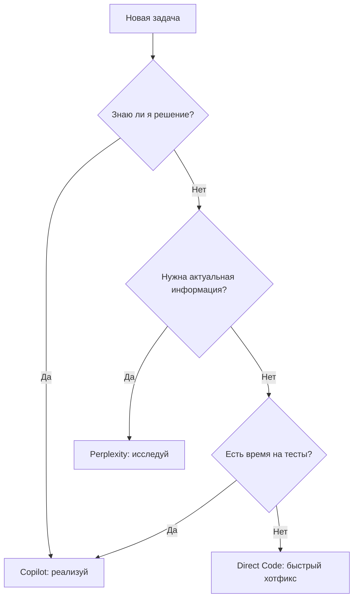

# 🎯 Decision Matrix: Copilot vs Perplexity vs Direct Code

> **Цель**: Быстро определить, кто должен решать задачу

---

## ⚡ Быстрая проверка (5 секунд)



---

## 📊 Детальная матрица

### **Категория 1: Исправление багов**

| Тип бага | Кто решает | Время | Пример |
|----------|------------|-------|--------|
| `TypeError`, `AttributeError` | ✅ **Copilot** | 5-10 мин | `'NoneType' has no attribute 'append'` |
| Логическая ошибка (очевидная) | ✅ **Copilot** | 10-20 мин | `if x > 0:` → `if x >= 0:` |
| Редкий edge case | 🔍 **Perplexity** → Copilot | 30-60 мин | "Как обработать NaN в pandas при .diff()?" |
| Гонка данных (race condition) | 🔍 **Perplexity** → Copilot | 1-2 часа | "Thread-safe queue в Python" |

---

### **Категория 2: Новые функции**

| Тип функции | Кто решает | Время | Пример |
|-------------|------------|-------|--------|
| CRUD операция (стандартная) | ✅ **Copilot** | 20-30 мин | `POST /api/strategies` |
| Сложный алгоритм | 🔍 **Perplexity** → Copilot | 2-4 часа | Position sizing (Kelly Criterion) |
| UI компонент (стандартный) | ✅ **Copilot** | 15-30 мин | React таблица с пагинацией |
| Интеграция с внешним API | 🔍 **Perplexity** → Copilot | 1-2 часа | Bybit API rate limits |

---

### **Категория 3: Рефакторинг**

| Тип рефакторинга | Кто решает | Время | Пример |
|------------------|------------|-------|--------|
| Удаление дубликатов | ✅ **Copilot** | 10-20 мин | Консолидация 4 файлов в 1 |
| Переименование переменных | ✅ **Copilot** | 5-10 мин | `data` → `kline_data` |
| Смена архитектуры | 🔍 **Perplexity** → Copilot | 4-8 часов | Monolith → Microservices |
| Оптимизация производительности | 🔍 **Perplexity** → Copilot | 2-3 часа | "Ускорить pandas .groupby()" |

---

### **Категория 4: Тестирование**

| Тип теста | Кто решает | Время | Пример |
|-----------|------------|-------|--------|
| Unit-тест (простой) | ✅ **Copilot** | 5-10 мин | `test_function_returns_int()` |
| Integration test | ✅ **Copilot** | 20-30 мин | API endpoint с БД |
| Property-based testing | 🔍 **Perplexity** → Copilot | 1-2 часа | "Hypothesis testing для финансовых расчетов" |
| Load testing | 🔍 **Perplexity** → Copilot | 2-3 часа | "Locust vs k6 для WebSocket" |

---

### **Категория 5: Безопасность**

| Задача | Кто решает | Время | Пример |
|--------|------------|-------|--------|
| Input validation | ✅ **Copilot** | 10-15 мин | Pydantic схемы |
| SQL injection защита | ✅ **Copilot** (SQLAlchemy) | 15-20 мин | Параметризованные запросы |
| RBAC implementation | 🔍 **Perplexity** → Copilot | 3-4 часа | "FastAPI RBAC best practices" |
| OAuth2 / JWT setup | 🔍 **Perplexity** → Copilot | 2-3 часа | "Secure token refresh flow" |

---

### **Категория 6: База данных**

| Задача | Кто решает | Время | Пример |
|--------|------------|-------|--------|
| Простая миграция | ✅ **Copilot** | 10-15 мин | `ADD COLUMN status TEXT` |
| Индексы (стандартные) | ✅ **Copilot** | 15-20 мин | `CREATE INDEX ON backtests(user_id)` |
| Query optimization | 🔍 **Perplexity** → Copilot | 1-2 часа | "PostgreSQL JSONB индексы" |
| Sharding / Partitioning | 🔍 **Perplexity** → Copilot | 4-6 часов | "TimescaleDB для финансовых данных" |

---

## 🚨 Исключения: Когда писать код напрямую

| Сценарий | Условие | Пример |
|----------|---------|--------|
| **Hotfix в продакшене** | Система down, клиенты жалуются | `SET timeout = 60` в PostgreSQL |
| **Одноразовый скрипт** | Задача больше не повторится | `python fix_timestamps.py` (разовая миграция) |
| **Конфигурация** | Простой `.env` файл | `DB_HOST=localhost` |
| **Prototype** | Проверка идеи за 5 минут | `temp_test.py` с 10 строками |

**Критерий**: Скорость важнее качества, код **не попадет в git**.

---

## 🎓 Примеры решений

### **Пример 1: "Добавить фильтр по дате в бэктесты"**
```
✅ COPILOT
Причина: Стандартная CRUD операция
Файлы: backend/routers/backtests.py, tests/test_backtests.py
Время: 20 минут
```

### **Пример 2: "Реализовать Kelly Criterion для position sizing"**
```
🔍 PERPLEXITY → COPILOT
Причина: Нужна теория + best practices + edge cases
Шаги:
1. Perplexity: "Kelly Criterion для крипто-трейдинга"
2. User: Резюме исследования
3. Copilot: Реализация + тесты
Время: 2-3 часа
```

### **Пример 3: "Исправить баг: неверный расчет PnL"**
```
✅ COPILOT
Причина: Логическая ошибка в коде
Файлы: backend/core/backtest_engine.py
Время: 15 минут
```

### **Пример 4: "Оптимизировать запрос к БД (медленный на 1M строк)"**
```
🔍 PERPLEXITY → COPILOT
Причина: Нужен бенчмаркинг + индексы + EXPLAIN ANALYZE
Шаги:
1. Perplexity: "PostgreSQL optimization для больших таблиц"
2. User: Запустить EXPLAIN ANALYZE
3. Copilot: Добавить индексы + переписать запрос
Время: 1-2 часа
```

### **Пример 5: "Добавить кнопку 'Экспорт в CSV'"**
```
✅ COPILOT
Причина: Стандартный UI + backend endpoint
Файлы: frontend/pages/BacktestDetailPage.tsx, backend/routers/backtests.py
Время: 30 минут
```

---

## 📏 Метрики для оценки

### **Индикаторы "Copilot Solo"**
- ✅ Задача **похожа** на уже решенные
- ✅ Требуется **0-1 зависимость** (библиотека)
- ✅ **Нет** вопросов "как лучше сделать?"
- ✅ Время решения **< 1 часа**

### **Индикаторы "Perplexity Research"**
- ❓ Несколько **вариантов решения** (выбор)
- ❓ Нужны **актуальные данные** (2024-2025)
- ❓ **Безопасность** или **производительность** критичны
- ❓ Время решения **> 1 часа**

### **Индикаторы "Direct Code"**
- 🔥 **Срочно** (production down)
- 🔥 **Одноразово** (не будет в git)
- 🔥 **Тривиально** (< 5 строк кода)

---

## 🔄 Workflow в действии

### **Стандартная задача (Copilot)**
```bash
User: "Добавить поле 'description' в стратегии"
Copilot: "Создаю миграцию Alembic..."
[5 минут спустя]
Copilot: "Готово! Тесты 100%, PR #456"
```

### **Исследовательская задача (Perplexity → Copilot)**
```bash
User: "Реализовать margin call simulation"
Copilot: "Создал Issue #7. Нужно исследование Bybit liquidation mechanics"

User → Perplexity:
Q: "How does Bybit calculate liquidation price for cross margin?"
A: [Подробный ответ с формулами]

User → Copilot: "Вот формулы от Perplexity: [резюме]"
Copilot: "Реализую с учетом формул..."
[2 часа спустя]
Copilot: "Готово! Тесты 100%, PR #458"
```

### **Экстренный хотфикс (Direct Code)**
```bash
User: "Production БД упала, timeout 5 секунд!"
User: [Пишет напрямую в psql]
psql> SET statement_timeout = '60s';
[Система восстановлена]
User → Copilot: "Теперь зафиксируй это в конфиге навсегда"
Copilot: "Добавляю в alembic + docker-compose..."
```

---

## 🎯 Итоговая схема принятия решений

```
┌─────────────────────────────┐
│   Новая задача получена     │
└──────────┬──────────────────┘
           │
           ▼
      ┌─────────┐
      │ СРОЧНО? │──Yes──→ Direct Code (hotfix)
      └────┬────┘
           No
           │
           ▼
   ┌───────────────┐
   │ СТАНДАРТНАЯ?  │──Yes──→ Copilot Solo
   └───────┬───────┘
           No
           │
           ▼
  ┌─────────────────┐
  │ НУЖНА ТЕОРИЯ?   │──Yes──→ Perplexity → Copilot
  └─────────────────┘
           No
           │
           ▼
    [Копай глубже, читай код]
```

---

## ✅ Чеклист перед стартом

Перед началом любой задачи **спроси себя**:

- [ ] **Понятна ли мне задача на 100%?** → Нет? → Попроси уточнений
- [ ] **Это стандартная операция?** → Да? → Copilot Solo
- [ ] **Нужна актуальная информация?** → Да? → Perplexity
- [ ] **Есть ли уже похожий код?** → Да? → `grep_search` → Copilot
- [ ] **Это срочный хотфикс?** → Да? → Direct Code (временно)
- [ ] **Задача займет > 1 часа?** → Да? → Раздели на подзадачи

---

**Правило 80/20**: 
- **80% задач** → Copilot Solo
- **15% задач** → Perplexity + Copilot
- **5% задач** → Direct Code (экстренные)

**Помни**: Лучше потратить 10 минут на исследование, чем 2 часа на неправильную реализацию! 🚀
