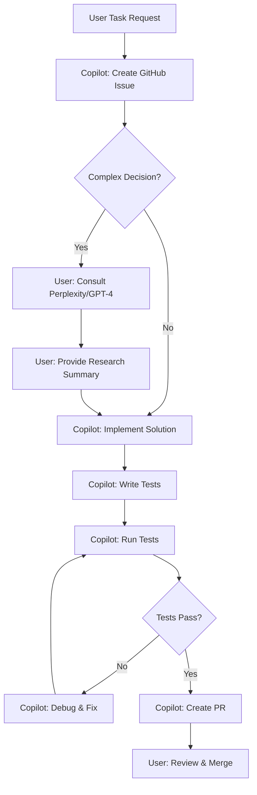

# Multi-Agent Workflow: Copilot + Research Assistant

## � DECISION MATRIX: Кто делает что?

### **Когда использовать только Copilot** ✅
| Задача | Действие | Примеры |
|--------|----------|---------|
| **Исправление багов** | Copilot: анализ → фикс → тесты | `TypeError`, `None`, индексы |
| **Простой рефакторинг** | Copilot: переименование, реструктуризация | Удаление дубликатов кода |
| **Стандартные UI компоненты** | Copilot: React/TypeScript по паттернам | Кнопки, формы, таблицы |
| **Простые тесты** | Copilot: unit-тесты для существующего кода | `test_function_returns_value()` |
| **Документация кода** | Copilot: docstrings, комментарии | `"""Calculate position size."""` |
| **Форматирование/линтинг** | Copilot: `black`, `eslint`, `prettier` | Автоформатирование |

**Критерий**: Задача **очевидна** и имеет **единственное правильное решение**.

---

### **Когда запрашивать Perplexity** 🔍
| Задача | Почему Perplexity | Что спрашивать |
|--------|-------------------|----------------|
| **Новый алгоритм** | Нужна теория + best practices | "Kelly Criterion для крипто-трейдинга" |
| **Оптимизация производительности** | Benchmarking, профилирование | "FastAPI vs Flask для WebSocket" |
| **Выбор библиотеки** | Сравнение альтернатив | "pandas vs polars для 1M+ строк" |
| **Отраслевые стандарты** | Актуальные практики 2024-2025 | "Современные паттерны React Hooks" |
| **API дизайн** | REST/GraphQL best practices | "Pagination для large datasets" |
| **Безопасность (общие вопросы)** | CVE, рекомендации OWASP | "SQL injection защита FastAPI" |

**Критерий**: Нужна **актуальная информация** или **сравнение подходов**.

---

### **Когда писать код напрямую** 🛠️
| Сценарий | Когда | Примеры |
|----------|-------|---------|
| **Прототипирование** | Быстрая проверка идеи | `temp_test.py` |
| **Конфигурация** | Простые файлы настроек | `.env`, `config.json` |
| **Скрипты миграции** | Одноразовые задачи | SQL DDL, `alembic` |
| **Hotfix в проде** | Срочное исправление | Минимальный патч |

**Критерий**: Нужна **скорость**, код **одноразовый** или **тривиальный**.

---

## �🏗️ Architecture



---

## 📋 Workflow Steps

### **Phase 1: Task Creation (Copilot)**
```markdown
User: "Fix position sizing - positions too large"

Copilot:
1. Create GitHub Issue #123: "Bug: Position sizes exceed risk tolerance"
2. Add labels: `bug`, `high-priority`, `backtesting`
3. Assign to milestone: "High Priority Anomalies"
4. Set description:
   ```
   **Problem**: Backtest positions are 50%+ of capital, causing liquidations
   **Expected**: Max 10% per position
   **Files**: backend/core/backtest_engine.py, backend/core/position_sizing.py
   **Tests needed**: test_position_sizing.py
   ```
```

### **Phase 2: Research (User + Perplexity/GPT-4)**

**When to request research:**
- ❓ New algorithm/pattern needed
- ❓ Security/performance critical decisions
- ❓ Multiple implementation approaches exist
- ❓ Industry best practices unclear

**User action:**
```markdown
User copies issue to Perplexity:
> "What are the best practices for position sizing in crypto trading backtests?
> Context: Python backtesting system, need to prevent liquidations.
> Current problem: positions are 50%+ of capital"

Perplexity responds with:
1. Kelly Criterion (optimal growth, aggressive)
2. Fixed Fractional (2-5% per trade, conservative)
3. Volatility-based (ATR-adjusted, adaptive)

User provides summary to Copilot:
"Use Fixed Fractional (3% default) with Kelly Criterion as option for advanced users.
ATR-based sizing for volatile markets."
```

### **Phase 3: Implementation (Copilot)**
```python
# Copilot implements based on research
class PositionSizer:
    """Position sizing strategies for risk management."""
    
    def __init__(self, method: str = "fixed_fractional"):
        self.method = method
    
    def calculate(
        self,
        capital: float,
        price: float,
        risk_pct: float = 0.03  # Research: 3% default
    ) -> float:
        """Calculate position size based on strategy."""
        if self.method == "fixed_fractional":
            return self._fixed_fractional(capital, risk_pct)
        elif self.method == "kelly":
            return self._kelly_criterion(capital, price)
        else:
            raise ValueError(f"Unknown method: {self.method}")
```

### **Phase 4: Testing (Copilot)**
```python
# tests/test_position_sizing.py
def test_fixed_fractional_sizing():
    """Test that fixed fractional sizing caps at 3% of capital."""
    sizer = PositionSizer(method="fixed_fractional")
    capital = 10000
    price = 50
    
    position = sizer.calculate(capital, price, risk_pct=0.03)
    
    assert position <= capital * 0.03 / price  # Max 3% of capital
    assert position > 0  # Always positive
```

### **Phase 5: Validation & PR (Copilot)**
```markdown
Copilot:
1. Run tests: `pytest tests/test_position_sizing.py -v`
2. Check coverage: `pytest --cov=backend/core/position_sizing.py`
3. Create PR: "feat: Implement risk-based position sizing (Fixes #123)"
4. Link PR to issue
5. Request user review
```

---

## 🔄 Decision Matrix: When to Research

| Scenario | Copilot Solo | Research Required |
|----------|--------------|-------------------|
| Bug fix (obvious logic error) | ✅ | ❌ |
| New algorithm (position sizing) | ❌ | ✅ Perplexity |
| UI component (standard pattern) | ✅ | ❌ |
| Security critical (auth, RBAC) | ❌ | ✅ GPT-4 + Docs |
| Performance optimization | ❌ | ✅ Perplexity |
| Database schema change | ❌ | ✅ PostgreSQL docs |
| Simple refactoring | ✅ | ❌ |
| API design (new endpoint) | ❌ | ✅ FastAPI best practices |

---

## 🎯 Current High Priority Tasks

### **Task #1: Position Sizing (Issue #4)**
**Status**: Ready for Research
**Research Query**: 
```
"Best practices for position sizing in crypto backtesting systems.
Requirements:
- Prevent liquidations (max loss tolerance)
- Support multiple strategies (Kelly, Fixed %, ATR-based)
- Python implementation with type hints
- Suitable for FastAPI backend"
```

**Expected Research Output**:
- Algorithm comparison table
- Recommended default values
- Edge case handling (zero volatility, negative returns)
- Code examples

---

### **Task #2: Signal Exit Logic (Issue #5)**
**Status**: Ready for Research
**Research Query**:
```
"How to prevent premature exits in trend-following strategies?
Problem: Strategy exits on small pullbacks during strong trends
Context: Bybit perpetual futures, 1-minute to daily timeframes
Need: Exit rules that distinguish pullback vs reversal"
```

---

### **Task #3: Buy & Hold Benchmark (Issue #6)**
**Status**: Implementation Ready (No research needed)
**Rationale**: Standard calculation, well-documented

---

### **Task #4: Margin Call Simulation (Issue #7)**
**Status**: Ready for Research
**Research Query**:
```
"How to accurately simulate margin calls and liquidations in crypto backtests?
Exchange: Bybit
Leverage: 1-100x
Margin mode: Cross margin and isolated margin
Need: Realistic liquidation price calculation"
```

---

## 📝 Communication Templates

### **Template 1: Request Research**
```markdown
@User - Research needed for Issue #123

**Question**: [Specific technical question]
**Context**: [Current implementation, constraints]
**Options considered**: [If any]
**Decision impact**: [Performance/Security/UX]

Please consult Perplexity/GPT-4 and provide summary with:
- Recommended approach
- Trade-offs
- Code examples (if available)
```

### **Template 2: Research Summary (User provides)**
```markdown
Research Summary for Issue #123

**Source**: Perplexity AI / GPT-4 / Official Docs
**Recommendation**: [Chosen approach]
**Rationale**: [Why this is best for our use case]
**Implementation notes**: 
- [Key point 1]
- [Key point 2]
**References**: [Links if available]

@Copilot - Proceed with implementation
```

### **Template 3: Implementation Complete**
```markdown
✅ Issue #123 - Implementation Complete

**Files changed**:
- backend/core/position_sizing.py (new file)
- tests/test_position_sizing.py (new file)
- backend/core/backtest_engine.py (updated)

**Tests**: 15/15 passing (100%)
**Coverage**: 95% (position_sizing.py)

**PR**: #456 "feat: Implement risk-based position sizing"
**Ready for review**
```

---

## 🛡️ Safety Rules

1. **Never implement complex algorithms without research**
2. **Never skip tests** - minimum 80% coverage
3. **Never commit untested code**
4. **Always link commits to issues** - use `Fixes #123`
5. **Always request review for security-critical changes**

---

## 🚀 Quick Start

### **Starting a new task:**
```bash
# User provides task
User: "Implement position sizing with risk management"

# Copilot creates issue
Copilot: "Created Issue #123 - Awaiting research on position sizing algorithms"

# User researches
User: [Consults Perplexity, provides summary]

# Copilot implements
Copilot: "Implementing Fixed Fractional sizing based on research..."

# Tests pass
Copilot: "Tests passing, PR #456 ready for review"

# User merges
User: "Merged PR #456, closing Issue #123"
```

---

## 📊 Metrics

Track effectiveness:
- **Issues created**: Auto-tracked in GitHub
- **Research requests**: Tag with `needs-research` label
- **Implementation time**: Track from research → PR
- **Test coverage**: Target 95%+
- **Bug regression**: Track reopened issues

---

**Remember**: This is a **cooperative system**. Copilot handles execution, User handles strategic research. Together we build better software! 🚀
