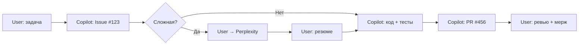

# ⚡ Quick Reference: Multi-Agent Workflow

> **1 страница - все, что нужно знать**

---

## 🎯 Кто что делает?

| Агент | Задачи | Когда использовать |
|-------|--------|-------------------|
| **GitHub Copilot** | Код, тесты, рефакторинг | Стандартные операции |
| **Perplexity AI** | Исследования, best practices | Новые алгоритмы, архитектура |
| **User (ты)** | Координация, ревью, решения | Всегда |

---

## 📋 Decision Tree (5 секунд)

```
Задача → Знаю решение? 
         ├─ Да → Copilot Solo
         └─ Нет → Нужна актуальная инфо?
                  ├─ Да → Perplexity → Copilot
                  └─ Нет → Copilot попробует
```

---

## ✅ Copilot Solo (80% задач)

**Когда:**
- ✅ Исправление багов (`TypeError`, `None`, индексы)
- ✅ CRUD операции (новый API endpoint)
- ✅ UI компоненты (кнопки, таблицы)
- ✅ Простой рефакторинг (переименование, удаление дубликатов)
- ✅ Unit-тесты для существующего кода

**Пример:** "Добавь фильтр по дате в бэктесты"
```bash
User: "Add date filter to backtests API"
Copilot: "Implementing in backend/routers/backtests.py..."
[15 минут спустя]
Copilot: "Done! Tests 100%, PR #456"
```

---

## 🔍 Perplexity → Copilot (15% задач)

**Когда:**
- ❓ Новый алгоритм (position sizing, Kelly Criterion)
- ❓ Оптимизация производительности (медленные запросы)
- ❓ Выбор библиотеки (pandas vs polars)
- ❓ Безопасность/архитектура (RBAC, OAuth2)
- ❓ Интеграция API (rate limits, webhooks)

**Пример:** "Реализуй position sizing"
```bash
User: "Implement Kelly Criterion for position sizing"
Copilot: "Created Issue #4. Research needed on Kelly formula"

User → Perplexity:
"What's the best position sizing method for crypto backtesting?"

Perplexity:
"Kelly Criterion (aggressive), Fixed Fractional (conservative, 2-5%).
For backtests, use Fixed Fractional 3% default."

User → Copilot: "Use Fixed Fractional 3%, add Kelly as option"
Copilot: "Implementing backend/core/position_sizing.py..."
[2 часа спустя]
Copilot: "Done! Tests 100%, PR #457"
```

---

## 🛠️ Direct Code (5% задач)

**Когда:**
- 🔥 Production hotfix (система упала)
- 🔥 Одноразовый скрипт (больше не повторится)
- 🔥 Быстрый прототип (проверить идею за 5 минут)

**Пример:** "БД упала, timeout!"
```bash
User: [Пишет напрямую в psql]
psql> SET statement_timeout = '60s';
[Система восстановлена]

User → Copilot: "Зафиксируй это в конфиге"
Copilot: "Adding to alembic migration..."
```

---

## 📊 Примеры задач

### **Простая (Copilot)** - 15 мин
```
✅ "Add export to CSV button"
Files: frontend/pages/BacktestDetailPage.tsx
Action: Copilot → Code → Tests → PR
```

### **Средняя (Perplexity → Copilot)** - 2 часа
```
🔍 "Implement margin call simulation"
Steps:
1. Perplexity: "How does Bybit calculate liquidation price?"
2. User: Summary to Copilot
3. Copilot: Code + Tests + PR
```

### **Срочная (Direct Code)** - 5 мин
```
🔥 "Fix production timeout NOW"
Action: Direct SQL → Copilot фиксирует в коде позже
```

---

## 🔄 Workflow в действии



---

## 🎯 Текущие задачи

### **Task #1: Position Sizing** 
**Status**: Ready for Research  
**Action**: User → Perplexity: "Best position sizing methods for crypto backtesting"

### **Task #2: Exit Logic Fix**
**Status**: Ready for Research  
**Action**: User → Perplexity: "Trend vs reversal detection strategies"

### **Task #3: Buy & Hold Benchmark**
**Status**: Implementation Ready  
**Action**: Copilot Solo (стандартная формула)

### **Task #4: Margin Call Simulation**
**Status**: Ready for Research  
**Action**: User → Perplexity: "Bybit liquidation mechanics"

---

## 📚 Полная документация

- **Decision Matrix**: `.github/DECISION_MATRIX.md` (детальная таблица)
- **Multi-Agent Workflow**: `.github/MULTI_AGENT_WORKFLOW.md` (полный процесс)
- **Copilot Instructions**: `.github/COPILOT_INSTRUCTIONS.md` (для AI)
- **Quick Start**: `QUICKSTART_MULTI_AGENT.md` (начало работы)

---

## ✅ Чеклист перед стартом

- [ ] Понятна ли задача на 100%?
- [ ] Это стандартная операция? → Copilot
- [ ] Нужна актуальная информация? → Perplexity
- [ ] Есть похожий код? → `grep_search` → Copilot
- [ ] Срочно? → Direct Code (временно)

---

## 🚀 Начать сейчас

```powershell
# Проверить MCP серверы
code .vscode/mcp.json

# Открыть Decision Matrix
code .github/DECISION_MATRIX.md

# Создать первую задачу
# User: "Implement position sizing"
# Copilot: "Creating Issue #4..."
```

---

**Правило 80/20**: 80% задач → Copilot Solo | 15% → Perplexity + Copilot | 5% → Direct Code

**Помни**: Лучше 10 минут на исследование, чем 2 часа на неправильную реализацию! 🎯
