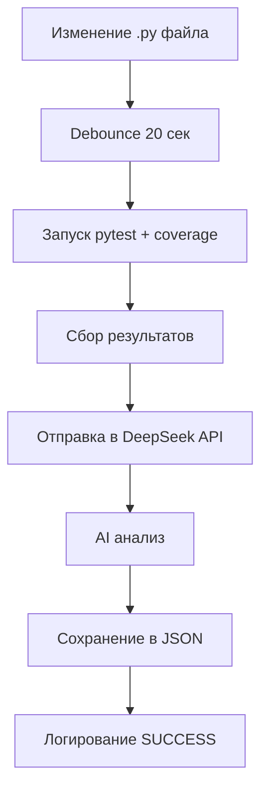

# 🔍 Test Watcher - Автоматическая верификация тестов

**Версия**: 1.0.0  
**Дата**: 7 ноября 2025  
**Статус**: ✅ Готово к использованию

---

## 📋 Описание

Test Watcher - это автоматическая система верификации тестов для Bybit Strategy Tester V2, которая:

- ✅ **Мониторит изменения** Python файлов в реальном времени
- ✅ **Автоматически запускает** pytest с измерением покрытия кода
- ✅ **Анализирует результаты** через DeepSeek AI
- ✅ **Сохраняет отчеты** в структурированном формате
- ✅ **Интегрируется с KeyManager** для безопасного хранения API ключей

---

## 🚀 Быстрый старт

### Шаг 1: Установка зависимостей

```powershell
# Автоматическая установка (рекомендуется)
.\automation\task1_test_watcher\start_watcher.ps1

# Или вручную
pip install -r automation/task1_test_watcher/requirements.txt
```

### Шаг 2: Настройка API ключа

**Вариант A: Использовать существующий encrypted_secrets.json** (рекомендуется)
```powershell
# Ключ уже зашифрован в encrypted_secrets.json
# Просто убедитесь что ENCRYPTION_KEY в .env
```

**Вариант B: Добавить в .env** (если нет encrypted_secrets.json)
```env
DEEPSEEK_API_KEY=your_actual_api_key_here
```

### Шаг 3: Запуск

```powershell
# Запуск через PowerShell скрипт (рекомендуется)
.\automation\task1_test_watcher\start_watcher.ps1

# Или напрямую через Python
python automation/task1_test_watcher/test_watcher.py
```

---

## 🏗️ Архитектура

```
automation/task1_test_watcher/
├── test_watcher.py          # Основной код
├── requirements.txt         # Зависимости Python
├── start_watcher.ps1        # Скрипт запуска для Windows
├── README.md               # Документация (этот файл)
└── IMPLEMENTATION_STATUS.md # Статус внедрения
```

---

## 🔧 Функциональность

### 1. Мониторинг файлов

- **Отслеживает**: `.py`, `.pyx`, `.pyi` файлы
- **Режим**: Рекурсивный мониторинг всей директории проекта
- **Debouncing**: 20 секунд для предотвращения спама
- **События**: Создание, изменение, удаление файлов

### 2. Запуск тестов

- **Framework**: pytest с coverage
- **Параметры**: `-v --tb=short --disable-warnings --color=yes`
- **Покрытие**: Детальная статистика по каждому файлу
- **Метрики**:
  - Exit code тестов
  - Общее покрытие (%)
  - Покрытие по файлам
  - Покрытые/непокрытые строки

### 3. AI Анализ через DeepSeek

- **Модель**: deepseek-chat
- **Температура**: 0.3 (фокус на точность)
- **Max tokens**: 2000
- **Анализирует**:
  - Качество тестов
  - Пробелы в покрытии
  - Потенциальные проблемы
  - Рекомендации по улучшению
  - Оценка рисков

### 4. Сохранение результатов

- **Формат**: JSON с полной трассируемостью
- **Директория**: `ai_audit_results/`
- **Имя файла**: `test_watcher_audit_<timestamp>.json`
- **Содержит**:
  - Список измененных файлов
  - Результаты тестов
  - AI анализ от DeepSeek
  - Метаданные запуска

---

## 📊 Формат отчета

```json
{
  "timestamp": 1699370400,
  "changed_files": [
    "backend/core/strategy.py",
    "tests/test_strategy.py"
  ],
  "test_results": {
    "pytest_exit_code": 0,
    "coverage_total": 87.5,
    "coverage_by_file": {
      "backend/core/strategy.py": {
        "total_lines": 250,
        "covered_lines": 218,
        "missing_lines": 32,
        "coverage_percent": 87.2
      }
    },
    "success": true
  },
  "analysis_results": {
    "analysis": "Detailed AI analysis...",
    "model": "deepseek-chat",
    "usage": {
      "prompt_tokens": 450,
      "completion_tokens": 320
    },
    "success": true
  },
  "metadata": {
    "watch_path": "D:\\bybit_strategy_tester_v2",
    "debounce_seconds": 20
  }
}
```

---

## ⚙️ Конфигурация

### Переменные окружения (.env)

```env
# Обязательные (если используется KeyManager)
ENCRYPTION_KEY=your_encryption_key_here

# Обязательные (если НЕ используется KeyManager)
DEEPSEEK_API_KEY=your_deepseek_api_key_here

# Опциональные
DEEPSEEK_API_URL=https://api.deepseek.com/v1/chat/completions
WATCH_PATH=.
DEBOUNCE_SECONDS=20
LOG_LEVEL=INFO
```

### Параметры в коде

```python
watcher = TestWatcher(
    watch_path=".",          # Директория для мониторинга
    debounce_seconds=20      # Время ожидания после изменений
)
```

---

## 🔐 Интеграция с KeyManager

Test Watcher автоматически использует KeyManager для безопасного получения API ключей:

```python
# Автоматическая инициализация
self.key_manager = KeyManager()
self._init_api_keys()

# Приоритет загрузки:
# 1. encrypted_secrets.json (через KeyManager)
# 2. .env (fallback)
```

**Логирование**:
```
[OK] DEEPSEEK_API_KEY loaded from KeyManager
[WARN] Falling back to .env for API keys
[ERROR] DEEPSEEK_API_KEY not configured!
```

---

## 📝 Логирование

### Файл: `test_watcher.log`

- **Rotation**: 10 MB максимум
- **Уровень**: INFO (по умолчанию)
- **Формат**: Timestamp + Level + Message

**Примеры логов**:
```
2025-11-07 13:30:00 | INFO | Starting TestWatcher on path: D:\bybit_strategy_tester_v2
2025-11-07 13:30:01 | INFO | File changed: backend/core/strategy.py
2025-11-07 13:30:21 | INFO | Processing 2 changed files
2025-11-07 13:30:22 | INFO | Running tests with coverage...
2025-11-07 13:30:45 | INFO | Tests completed with exit code: 0
2025-11-07 13:30:45 | INFO | Total coverage: 87.50%
2025-11-07 13:30:46 | INFO | Sending results to DeepSeek for analysis...
2025-11-07 13:30:50 | INFO | DeepSeek analysis completed successfully
2025-11-07 13:30:51 | SUCCESS | Test verification completed successfully
```

---

## 🛠️ Зависимости

```txt
watchdog>=3.0.0         # File system monitoring
pytest>=7.0.0           # Testing framework
pytest-cov>=4.0.0       # Coverage plugin for pytest
coverage>=7.0.0         # Code coverage measurement
httpx>=0.24.0           # Async HTTP client
loguru>=0.7.0           # Advanced logging
python-dotenv>=1.0.0    # Environment variables
```

---

## 🎯 Workflow



---

## ⚠️ Обработка ошибок

### Автоматическое восстановление:

- ✅ **API недоступен**: Логирование ошибки, сохранение результатов без AI анализа
- ✅ **Timeout запроса**: Retry не выполняется, результаты сохраняются
- ✅ **Ошибка тестов**: Результаты сохраняются с exit code и traceback
- ✅ **Coverage ошибка**: Fallback на пустой coverage report

### Graceful Shutdown:

```powershell
# Ctrl+C останавливает watcher корректно
# - Завершает текущий цикл обработки
# - Останавливает Observer
# - Закрывает все ресурсы
```

---

## 📈 Производительность

| Операция | Время |
|----------|-------|
| Обнаружение изменения | < 1 сек |
| Debounce период | 20 сек |
| Запуск тестов | 5-30 сек (зависит от кол-ва тестов) |
| DeepSeek API запрос | 3-10 сек |
| Сохранение результатов | < 1 сек |
| **Общее время** | **30-60 сек** |

---

## 🧪 Тестирование

### Ручное тестирование:

```powershell
# 1. Запустите Test Watcher
.\automation\task1_test_watcher\start_watcher.ps1

# 2. В другом терминале измените любой .py файл
echo "# test" >> backend\core\strategy.py

# 3. Наблюдайте логи в test_watcher.log
Get-Content test_watcher.log -Tail 20 -Wait

# 4. Проверьте результаты
Get-ChildItem ai_audit_results\test_watcher_audit_*.json | Select-Object -Last 1
```

---

## 🔄 Интеграция с CI/CD

### GitHub Actions Example:

```yaml
name: Test Watcher
on: [push, pull_request]

jobs:
  test-watch:
    runs-on: ubuntu-latest
    steps:
      - uses: actions/checkout@v3
      - name: Setup Python
        uses: actions/setup-python@v4
        with:
          python-version: '3.13'
      - name: Install dependencies
        run: pip install -r automation/task1_test_watcher/requirements.txt
      - name: Run single test cycle
        run: python automation/task1_test_watcher/test_watcher.py --once
        env:
          DEEPSEEK_API_KEY: ${{ secrets.DEEPSEEK_API_KEY }}
```

---

## 📚 Примеры использования

### Базовое использование:

```powershell
# Запуск с настройками по умолчанию
.\automation\task1_test_watcher\start_watcher.ps1
```

### Кастомные параметры:

```python
# В коде test_watcher.py можно изменить:
watcher = TestWatcher(
    watch_path="./backend",  # Мониторить только backend
    debounce_seconds=10      # Уменьшить debounce до 10 сек
)
```

### Использование с KeyManager:

```powershell
# Убедитесь что KeyManager настроен
echo $env:ENCRYPTION_KEY  # Должен быть установлен

# Проверьте зашифрованные ключи
Test-Path encrypted_secrets.json  # Должен существовать

# Запустите Test Watcher
.\automation\task1_test_watcher\start_watcher.ps1
# Вывод: [OK] DEEPSEEK_API_KEY loaded from KeyManager
```

---

## 🐛 Troubleshooting

### Проблема: "DEEPSEEK_API_KEY not configured"

**Решение**:
```powershell
# Проверьте .env
Get-Content .env | Select-String "DEEPSEEK_API_KEY"

# Или проверьте encrypted_secrets.json
Test-Path encrypted_secrets.json
```

### Проблема: "Virtual environment not found"

**Решение**:
```powershell
# Создайте venv
python -m venv .venv

# Активируйте и установите зависимости
.\.venv\Scripts\Activate.ps1
pip install -r requirements.txt
```

### Проблема: Tests не запускаются

**Решение**:
```powershell
# Проверьте что pytest установлен
.\.venv\Scripts\python.exe -m pytest --version

# Запустите тесты вручную
.\.venv\Scripts\python.exe -m pytest -v
```

### Проблема: Coverage данные пусты

**Решение**:
```powershell
# Убедитесь что coverage установлен
pip install coverage

# Проверьте .coveragerc конфигурацию
# (если есть, может фильтровать файлы)
```

---

## 📖 API Reference

### TestWatcher Class

```python
class TestWatcher:
    def __init__(
        self,
        watch_path: str = ".",
        debounce_seconds: int = 20
    )
    
    async def start() -> None
    def stop() -> None
    async def run_tests() -> Dict
    async def send_to_deepseek(
        test_results: Dict,
        changed_files: List[Path]
    ) -> Dict
```

---

## 🎓 Следующие шаги

После успешного внедрения Test Watcher:

1. ✅ **Мониторинг работы** в течение 1-2 недель
2. ✅ **Анализ отчетов** в `ai_audit_results/`
3. ✅ **Настройка debounce** под ваш workflow
4. ✅ **Интеграция с CI/CD** для автоматического запуска
5. ➡️ **Переход к Task 3**: Audit Agent (фоновый агент)

---

## 📞 Поддержка

- **Логи**: `test_watcher.log`
- **Отчеты**: `ai_audit_results/test_watcher_audit_*.json`
- **GitHub Issues**: Для сообщения о багах

---

## 📄 Лицензия

MIT License

---

**Статус**: ✅ Готово к использованию  
**Версия**: 1.0.0  
**Дата**: 7 ноября 2025
