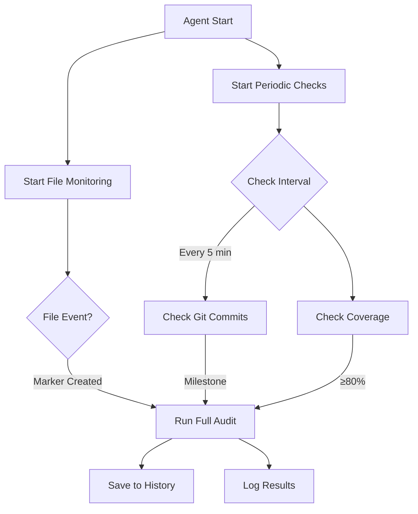

# 🔄 Audit Agent - Автоматический фоновый аудит проекта

**Версия**: 1.0.0  
**Дата**: 7 ноября 2025  
**Статус**: ✅ Готово к использованию

---

## 📋 Описание

Audit Agent - это фоновый агент для автоматического мониторинга проекта Bybit Strategy Tester V2, который:

- ✅ **Мониторит marker files** (`*_COMPLETE.md`, `PHASE_*.md`, `MILESTONE_*.md`)
- ✅ **Отслеживает Git коммиты** с milestone тегами (`[MILESTONE]`, `[CHECKPOINT]`)
- ✅ **Проверяет test coverage** (≥80% по умолчанию)
- ✅ **Автоматически запускает** полный AI аудит при триггерах
- ✅ **Ведет историю** всех запусков в JSON формате
- ✅ **Логирует события** в `audit_agent.log`

---

## 🚀 Быстрый старт

### Шаг 1: Установка зависимостей

```powershell
# Автоматическая установка через скрипт
.\automation\task3_audit_agent\start_agent.ps1 -InstallDeps

# Или вручную
pip install -r automation/task3_audit_agent/requirements.txt
```

### Шаг 2: Проверка конфигурации

Audit Agent автоматически использует конфигурацию из `config.py`:

```python
# Основные параметры
check_interval = 5          # минут (периодическая проверка)
coverage_threshold = 80.0   # процент (минимальное покрытие)
audit_script = "full_ai_audit_deepseek_perplexity_deepseek.py"
```

### Шаг 3: Запуск

```powershell
# Запуск через PowerShell скрипт (рекомендуется)
.\automation\task3_audit_agent\start_agent.ps1

# Или напрямую через Python
python automation\task3_audit_agent\audit_agent.py
```

---

## 🏗️ Архитектура

```
automation/task3_audit_agent/
├── audit_agent.py          # Основной код агента
├── config.py               # Конфигурация
├── requirements.txt        # Зависимости
├── start_agent.ps1         # PowerShell launcher
└── README.md              # Документация (этот файл)
```

---

## 🔧 Компоненты

### 1. AuditHistory

Управление историей запусков аудита:

```python
history = AuditHistory(history_file)
history.add_audit_record(
    trigger_reason="Marker created: TASK1_COMPLETE.md",
    status="SUCCESS",
    details="Audit completed in 273.5s"
)
```

**Файл**: `audit_history.json`  
**Формат**:
```json
[
  {
    "timestamp": "2025-11-07T14:00:00",
    "trigger_reason": "Marker created: TASK1_COMPLETE.md",
    "status": "SUCCESS",
    "details": "Audit completed in 273.5s"
  }
]
```

### 2. MarkerFileHandler

Мониторинг файловой системы через watchdog:

**Отслеживаемые паттерны**:
- `*_COMPLETE.md`
- `*_COMPLETION_REPORT.md`
- `PHASE_*.md`
- `MILESTONE_*.md`
- `TASK*_COMPLETION_REPORT.md`

**События**:
- `on_created` - создание файла
- `on_modified` - изменение файла

### 3. GitMonitor

Отслеживание Git коммитов с milestone тегами:

**Паттерны milestone коммитов**:
- `[MILESTONE]`
- `[CHECKPOINT]`
- `milestone` (case-insensitive)
- `checkpoint` (case-insensitive)
- `release`
- `version`

**Пример**:
```bash
git commit -m "[MILESTONE] Phase 1 complete"
# Agent обнаружит и запустит аудит
```

### 4. CoverageChecker

Проверка покрытия кода тестами:

**Методы**:
1. **coverage.py tool**: `python -m coverage report --format=total`
2. **coverage.xml**: Парсинг XML файла
3. **coverage.json**: Парсинг JSON файла
4. **.coverage**: Бинарный файл (не поддерживается)

**Триггер**: Coverage ≥ 80% (настраивается в `config.py`)

### 5. AuditAgent

Основной класс координации:

**Функции**:
- `start()` - запуск агента
- `stop()` - graceful shutdown
- `periodic_check()` - периодическая проверка триггеров (каждые 5 минут)
- `run_full_audit()` - запуск полного аудита
- `handle_marker_creation()` - обработка marker files

**Scheduler**: APScheduler (AsyncIOScheduler)

---

## ⚙️ Конфигурация

### config.py

```python
class AuditConfig:
    # Основные настройки
    project_root = Path(__file__).parent.parent.parent
    check_interval = 5  # минут
    
    # Файлы
    history_file = project_root / "audit_history.json"
    log_file = project_root / "audit_agent.log"
    audit_script = project_root / "full_ai_audit_deepseek_perplexity_deepseek.py"
    
    # Пороги
    coverage_threshold = 80.0  # процент
    
    # Паттерны marker files
    marker_patterns = [
        "*_COMPLETE.md",
        "*_COMPLETION_REPORT.md",
        "PHASE_*.md",
        "MILESTONE_*.md",
        "TASK*_COMPLETION_REPORT.md"
    ]
    
    # Флаги
    git_monitoring_enabled = True
    enable_file_monitoring = True
    enable_periodic_checks = True
```

### Переменные окружения (опционально)

```bash
# Переопределение через environment variables
export AUDIT_PROJECT_ROOT="/path/to/project"
export AUDIT_CHECK_INTERVAL=5
export AUDIT_COVERAGE_THRESHOLD=80
export AUDIT_SCRIPT_PATH="full_ai_audit_deepseek_perplexity_deepseek.py"
```

Используйте `EnvironmentConfig` вместо `AuditConfig`:

```python
from config import EnvironmentConfig
config = EnvironmentConfig()
agent = AuditAgent(config)
```

---

## 🔍 Триггеры аудита

### 1. File Markers (Real-time)

Agent мгновенно реагирует на создание/изменение marker files:

```
СОЗДАНИЕ: TASK1_COMPLETE.md
   ↓
ОБНАРУЖЕНИЕ: MarkerFileHandler
   ↓
ТРИГГЕР: "Marker created: TASK1_COMPLETE.md"
   ↓
ЗАПУСК: full_ai_audit_deepseek_perplexity_deepseek.py
```

### 2. Git Commits (Periodic, каждые 5 минут)

Agent проверяет новые коммиты с milestone тегами:

```
КОММИТ: git commit -m "[MILESTONE] Phase complete"
   ↓
ОБНАРУЖЕНИЕ: GitMonitor (через 0-5 минут)
   ↓
ТРИГГЕР: "Git commit: [MILESTONE] Phase complete"
   ↓
ЗАПУСК: full_ai_audit_deepseek_perplexity_deepseek.py
```

### 3. Coverage Threshold (Periodic, каждые 5 минут)

Agent проверяет достижение порога покрытия:

```
COVERAGE: 85.5% (≥ 80%)
   ↓
ОБНАРУЖЕНИЕ: CoverageChecker
   ↓
ТРИГГЕР: "Test coverage threshold reached"
   ↓
ЗАПУСК: full_ai_audit_deepseek_perplexity_deepseek.py
```

---

## 📊 Workflow



---

## 📝 Логирование

### audit_agent.log

**Формат**:
```
2025-11-07 14:00:00 - AuditAgent - INFO - Запуск аудит-агента
2025-11-07 14:00:00 - AuditAgent - INFO - Мониторинг файловой системы запущен
2025-11-07 14:00:00 - AuditAgent - INFO - Планировщик запущен с интервалом 5 минут
2025-11-07 14:05:12 - AuditAgent - INFO - Обнаружен новый маркер: TASK1_COMPLETE.md
2025-11-07 14:05:12 - AuditAgent - INFO - Запуск аудита по причине: Marker created: TASK1_COMPLETE.md
2025-11-07 14:09:45 - AuditAgent - INFO - Аудит успешно завершен за 273.5с
```

**Уровни логирования**:
- `INFO` - нормальная работа
- `WARNING` - предупреждения (агент уже запущен, файл не найден)
- `ERROR` - ошибки (скрипт не найден, ошибка Git команды)
- `DEBUG` - отладочная информация (периодические проверки)

---

## 📈 История запусков

### audit_history.json

**Структура**:
```json
[
  {
    "timestamp": "2025-11-07T14:05:12",
    "trigger_reason": "Marker created: TASK1_COMPLETE.md",
    "status": "SUCCESS",
    "details": "Audit completed in 273.5s"
  },
  {
    "timestamp": "2025-11-07T14:10:30",
    "trigger_reason": "Git commit: [MILESTONE] Task 1 complete",
    "status": "SUCCESS",
    "details": "Audit completed in 285.2s"
  },
  {
    "timestamp": "2025-11-07T14:15:45",
    "trigger_reason": "Test coverage threshold reached",
    "status": "FAILED",
    "details": "Error: Connection timeout"
  }
]
```

**Ограничения**: Хранятся последние 100 записей

---

## 🧪 Тестирование

### Ручное тестирование marker files:

```powershell
# Терминал 1: Запустить Agent
.\automation\task3_audit_agent\start_agent.ps1

# Терминал 2: Создать marker file
echo "# Task Complete" > TASK_TEST_COMPLETE.md

# Терминал 3: Наблюдать логи
Get-Content audit_agent.log -Tail 20 -Wait

# Результат: Agent обнаружит файл и запустит аудит
```

### Тестирование Git триггеров:

```bash
# Создать milestone коммит
git commit -m "[MILESTONE] Test milestone"
git push

# Agent обнаружит в течение 5 минут и запустит аудит
```

### Тестирование coverage триггера:

```powershell
# Запустить тесты с coverage
pytest --cov=backend --cov-report=json

# Если coverage ≥ 80%, agent запустит аудит при следующей проверке
```

---

## 🛠️ Зависимости

```txt
APScheduler>=3.10.4    # Async scheduler для периодических задач
watchdog>=3.0.0        # File system monitoring
coverage>=7.0.0        # Code coverage measurement (уже установлен)
```

**Установка**:
```powershell
pip install -r automation/task3_audit_agent/requirements.txt
```

---

## 🎯 Примеры использования

### Базовое использование:

```powershell
# Запуск с настройками по умолчанию
.\automation\task3_audit_agent\start_agent.ps1
```

### С установкой зависимостей:

```powershell
.\automation\task3_audit_agent\start_agent.ps1 -InstallDeps
```

### Программное использование:

```python
from audit_agent import AuditAgent
from config import AuditConfig
import asyncio

async def main():
    config = AuditConfig()
    agent = AuditAgent(config)
    
    try:
        await agent.start()
    except KeyboardInterrupt:
        await agent.stop()

if __name__ == "__main__":
    asyncio.run(main())
```

### Кастомная конфигурация:

```python
from config import AuditConfig

class MyConfig(AuditConfig):
    def __init__(self):
        super().__init__()
        self.check_interval = 10  # Проверка каждые 10 минут
        self.coverage_threshold = 90.0  # Порог 90%
        self.marker_patterns = ["*_DONE.md"]  # Кастомные паттерны
```

---

## ⚠️ Обработка ошибок

### Автоматическое восстановление:

- ✅ **Audit script не найден**: Логирование ошибки, запись в историю, продолжение работы
- ✅ **Git недоступен**: Логирование warning, пропуск Git проверки
- ✅ **Coverage недоступен**: Логирование warning, пропуск coverage проверки
- ✅ **Audit script завершился с ошибкой**: Запись в историю со статусом FAILED

### Graceful Shutdown:

```powershell
# Ctrl+C корректно останавливает agent:
# 1. Останавливает APScheduler
# 2. Останавливает watchdog Observer
# 3. Закрывает все ресурсы
# 4. Логирует завершение
```

---

## 📈 Производительность

| Операция | Время |
|----------|-------|
| Agent startup | < 5 сек |
| File event detection | < 1 сек |
| Git check | 1-3 сек |
| Coverage check | 1-5 сек |
| Full audit execution | 3-10 минут (зависит от аудита) |
| Periodic check cycle | 5-10 сек |

**Memory usage**: ~30-50 MB  
**CPU usage**: < 1% (idle), 5-10% (checking)

---

## 🔐 Безопасность

### ✅ Реализовано:
- ✅ Agent работает с правами текущего пользователя
- ✅ Не требует административных привилегий
- ✅ Все файлы создаются в рамках проекта
- ✅ Graceful shutdown предотвращает потерю данных
- ✅ История ограничена 100 записями (защита от переполнения)

### ⚠️ Рекомендации:
- Не запускать от имени root/Administrator (не требуется)
- Проверять права доступа к директории проекта
- Регулярно проверять логи на ошибки
- Резервировать `audit_history.json`

---

## 🐛 Troubleshooting

### Проблема: "Agent не запускается"

**Решение**:
```powershell
# Проверьте Python версию (≥3.7)
python --version

# Установите зависимости
pip install -r automation/task3_audit_agent/requirements.txt

# Проверьте права доступа
Test-Path audit_agent.py
```

### Проблема: "Audit не запускается автоматически"

**Решение**:
```powershell
# Проверьте путь к audit script в config.py
# Убедитесь что файл существует
Test-Path full_ai_audit_deepseek_perplexity_deepseek.py

# Проверьте логи
Get-Content audit_agent.log -Tail 50
```

### Проблема: "Git monitoring не работает"

**Решение**:
```powershell
# Проверьте Git установлен
git --version

# Проверьте что находитесь в Git репозитории
git status

# Проверьте логи agent
Get-Content audit_agent.log | Select-String "Git"
```

### Проблема: "Coverage проверка не работает"

**Решение**:
```powershell
# Убедитесь что coverage установлен
pip install coverage

# Запустите coverage вручную
python -m coverage report

# Создайте coverage файл
pytest --cov=backend --cov-report=json
```

---

## 🔄 Интеграция с CI/CD

### GitHub Actions Example:

```yaml
name: Audit Agent Monitor
on:
  schedule:
    - cron: '0 */6 * * *'  # Каждые 6 часов
  push:
    branches: [main, develop]

jobs:
  audit-check:
    runs-on: ubuntu-latest
    steps:
      - uses: actions/checkout@v3
      
      - name: Setup Python
        uses: actions/setup-python@v4
        with:
          python-version: '3.13'
      
      - name: Install dependencies
        run: pip install -r automation/task3_audit_agent/requirements.txt
      
      - name: Check audit history
        run: |
          if [ -f audit_history.json ]; then
            python -c "import json; h=json.load(open('audit_history.json')); print(f'Last audit: {h[-1]}' if h else 'No audits')"
          fi
```

---

## 📚 API Reference

### AuditAgent Class

```python
class AuditAgent:
    def __init__(self, config: AuditConfig)
    
    async def start() -> None
    async def stop() -> None
    
    async def check_completion_markers() -> List[str]
    async def handle_marker_creation(file_path: Path) -> None
    async def check_test_coverage_trigger() -> bool
    async def check_git_triggers() -> List[str]
    async def run_full_audit(trigger_reason: str) -> None
    async def periodic_check() -> None
```

### AuditHistory Class

```python
class AuditHistory:
    def __init__(self, history_file: Path)
    
    def load_history() -> List[Dict[str, Any]]
    def save_history(history: List[Dict[str, Any]]) -> None
    def add_audit_record(
        trigger_reason: str,
        status: str,
        details: str = ""
    ) -> None
```

---

## 🎓 Следующие шаги

После успешного запуска Audit Agent:

1. ✅ **Мониторинг работы** в течение 1-2 недель
2. ✅ **Анализ audit_history.json** на частоту срабатываний
3. ✅ **Настройка check_interval** под ваш workflow
4. ✅ **Интеграция с CI/CD** для централизованного мониторинга
5. ✅ **Настройка alerting** (email/Slack при FAILED статусах)

---

## 📞 Поддержка

- **Логи**: `audit_agent.log`
- **История**: `audit_history.json`
- **Конфигурация**: `automation/task3_audit_agent/config.py`
- **GitHub Issues**: Для сообщения о багах

---

## 📄 Лицензия

MIT License

---

**Статус**: ✅ Готово к использованию  
**Версия**: 1.0.0  
**Дата**: 7 ноября 2025
