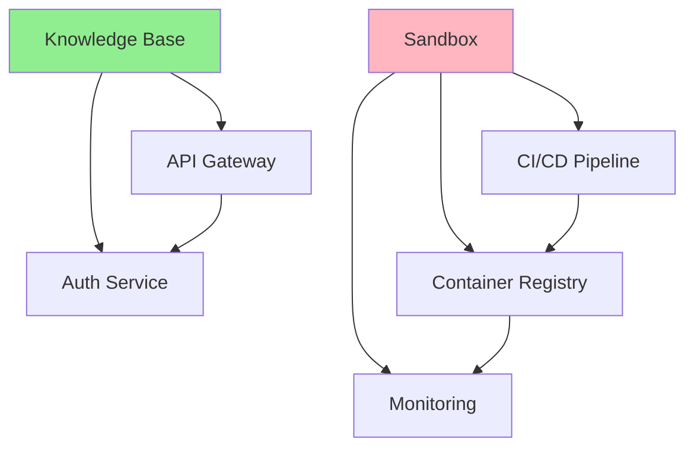

# Multi-Agent Collaboration Session

**Session ID:** 20251101_162537
**Date:** 2025-11-01 16:27:46

---

## 1. DeepSeek (2025-11-01T16:26:57.593577)

Отличный запрос. Давайте проведем детальный технический анализ этих двух критически важных компонентов для AI-ассистента.

### 1. Сложность реализации: Knowledge Base vs Sandbox

Сложность здесь не в абсолютных значениях, а в природе проблем. **Knowledge Base (База Знаний) сложнее в проектировании и обеспечении качества, в то время как Sandbox (Песочница) сложнее в реализации и обеспечении безопасности.**

#### Knowledge Base (База Знаний)

**Высокоуровневая сложность: Высокая (особенно на этапе проектирования и поддержания качества)**
*   **Проблема:** Не "как найти информацию", а "как найти *релевантную* и *достоверную* информацию".
*   **Ключевые вызовы:**
    1.  **Data Ingestion & ETL:** Сложность зависит от источников. Парсинг разноформатных данных (PDF, HTML, Word, маркдаун), обработка структурированных данных (API, БД). Требуются мощные пайплайны обработки.
    2.  **Векторизация и эмбеддинги:** Выбор модели эмбеддингов (например, `text-embedding-ada-002`, `all-MiniLM-L6-v2`). Качество поиска напрямую зависит от этого выбора. Необходимость чункинга (разбиения текста) с перекрытием для сохранения контекста.
    3.  **Поиск и RAG (Retrieval-Augmented Generation):**
        *   **Гибридный поиск:** Сочетание семантического (векторного) и лексического (ключевые слова, например, через BM25) поиска. Это уже стандарт для повышения релевантности.
        *   **Re-ranking:** Дополнительный этап, где найденные кандидаты пропускаются через отдельную модель для точной пересортировки по релевантности. Значительно увеличивает качество, но и сложность/латентность.
    4.  **Актуализация данных:** Механизмы обновления данных в индексе при изменении источников (incremental updates). Решение, что делать с устаревшей информацией.
    5.  **Grounding и предотвращение галлюцинаций:** Самая сложная часть. Система должна уметь говорить "Я не знаю", если информации нет в базе, а не выдумывать ответ.

#### Sandbox (Песочница)

**Высокоуровневая сложность: Высокая (особенно на этапе реализации и эксплуатации)**
*   **Проблема:** Не "как выполнить код", а "как выполнить *произвольный* код *безопасно* и *изолированно*".
*   **Ключевые вызовы:**
    1.  **Изоляция и Безопасность:** Это главный камень преткновения.
        *   **Контейнеризация (Docker):** Стандартный подход. Создание ephemeral (временных) контейнеров для каждого запроса. Сложность в "запекании" безопасного образа, ограничении ресурсов (CPU, RAM, сеть), времени выполнения.
        *   **gVisor / Firecracker:** Более продвинутые технологии для изоляции, уменьшающие атакуемую поверхность по сравнению с Docker.
        *   **Белые списки:** Запрет опасных системных вызовов, блокировка сетевого доступа (или доступ только к определенным白名单 addresses).
    2.  **Управление ресурсами:** Ограничение времени выполнения, памяти, дискового пространства. Прерывание "зависших" процессов.
    3.  **Интерпретаторы и зависимости:** Необходимость иметь предустановленные среды (Python, Node.js, bash) с набором популярных библиотек. Управление этими образами.
    4.  **Ввод/Вывод:** Механизм передачи входных данных в песочницу и получения результатов (stdout, stderr, файлы). Безопасная обработка больших объемов данных.

**Вердикт:** Для небольшой команды начать с простой векторной базы данных проще, чем построить безопасную песочницу. Однако, создание *качественной* и *надежной* Knowledge Base, которая не генерирует мусор, — это долгая итеративная задача, сравнимая по сложности с песочницей.

---

### 2. Технические зависимости между компонентами

Здесь архитектура строится вокруг LLM (например, GPT-4) как центрального процессора.

```mermaid
graph TD
    A[Пользовательский Запрос] --> B[LLM (Orchestrator)];

    subgraph "Внешние компоненты (Tools)"
        C[Knowledge Base]
        D[Sandbox]
        E[Прочие Tools<br/>e.g., Поиск в интернете]
    end

    B -- "Если нужны факты/данные" --> C;
    B -- "Если нужны вычисления/код" --> D;
    B -- "Если нужны актуальные данные" --> E;

    C -- "Извлеченные релевантные чанки" --> B;
    D -- "Результат выполнения кода<br/>(stdout, stderr)" --> B;
    E -- "Результаты поиска" --> B;

    B --> F[Финальный ответ пользователю];

    style B fill:#f9f,stroke:#333,stroke-width:2px
    style C fill:#ccf,stroke:#333,stroke-width:1px
    style D fill:#ccf,stroke:#333,stroke-width:1px
```

**Ключевые зависимости:**

1.  **LLM как оркестратор:** Оба компонента (KB и Sandbox) вызываются *агентом* на основе LLM. LLM решает, когда обратиться к Knowledge Base (запрос фактов), а когда к Sandbox (для вычислений).
2.  **Слабая связность между KB и Sandbox:** Прямой связи между ними нет. Они независимы и общаются только через LLM.
3.  **Зависимость от инфраструктуры:**
    *   **Общее хранилище:** Оба компонента могут зависеть от единой системы кэширования (например, Redis) для хранения промежуточных результатов или сессий.
    *   **Мониторинг и логирование:** Оба компонента интегрируются в единую систему мониторинга (логи, метрики, трейсинг).
4.  **Зависимость данных:** Sandbox *может* использовать данные, полученные из Knowledge Base, но только через цепочку вызовов: `KB -> LLM -> Sandbox`. Например, LLM извлекает из KB датасет, а затем генерирует код на Python для его анализа в Sandbox.

---

### 3. Оценка времени разработки (реалистичная)

Оценка для команды из 2-3 опытных инженеров. Время указано в человеко-неделях (пнз).

| Компонент / Этап | База Знаний (Knowledge Base) | Песочница (Sandbox) |
| :--- | :--- | :--- |
| **Прототип (MVP)** | **2-3 пнз** <br/>• Простой пайплайн для одного типа файлов.<br/>• Векторная БД (Chroma, FAISS).<br/>• Наивный RAG без re-ranking. | **3-4 пнз** <br/>• Docker-based изоляция.<br/>• Запуск предопределенного кода (Python).<br/>• Базовое ограничение ресурсов. |
| **Стабильная Beta** | **+4-6 пнз** <br/>• Гибридный поиск (вектор + ключ. слова).<br/>• Поддержка множества форматов файлов.<br/>• Система актуализации данных.<br/>• Базовый re-ranking. | **+5-7 пнз** <br/>• Динамический запуск любого кода.<br/>• Улучшенная безопасность (gVisor).<br/>• Надежное ограничение времени/памяти.<br/>• Механизм инжекта входных данных. |
| **Production Ready** | **+6-8+ пнз** <br/>• Кастомные модели эмбеддингов/re-ranker.<br/>• Сложные стратегии чункинга.<br/>• Мониторинг качества (precision/recall).<br/>• Эффективное "Я не знаю". | **+6-8+ пнз** <br/>• Высокоуровневая безопасность (Firecracker).<br/>• Поддержка нескольких языков/сред.<br/>• Балансировка нагрузки и оркестрация.<br/>• Детальный аудит и логирование. |
| ****Итого (реалистично)**** | **~12-17 пнз** | **~14-19 пнз** |

**Общий вывод по времени:** Оба компонента являются капитальными проектами. Для выхода на рынок с надежным продуктом, учитывая итерации и тестирование, **реалистичный срок на оба компонента — 3-4 месяца для сильной команды.** Начать с MVP и постепенно наращивать сложность — единственно верная стратегия.

---

## 2. Perplexity (2025-11-01T16:27:07.311260)

Для стратегической приоритизации между Quick Win #1 и #2, необходимо оценить бизнес-ценность каждого компонента, а также риски и способы их митигации, используя мультикритериальные подходы и best practices управления проектами.

---

**1. Приоритизация Quick Win #1 vs #2**

- **Quick Wins** — это задачи с высоким бизнес-value и низкими затратами на реализацию, которые дают быстрый и измеримый результат[3][5][7].
- Для объективной приоритизации используйте **Weighted Scoring Model** или аналогичные методы, где оцениваются:
    - Стратегическое соответствие
    - Финансовая выгода
    - Риск
    - Ресурсные требования
    - Срочность[2][11][13][17]

**Рекомендация по приоритизации:**
- Выберите тот Quick Win, который:
    - Имеет больший охват (Reach) и влияние (Impact) на бизнес-метрики[11].
    - Требует меньше усилий (Effort) и обладает высокой уверенностью в результате (Confidence)[11].
    - Лучше соответствует текущим стратегическим целям компании[2][17].

---

**2. Business value каждого компонента**

- **Quick Win #1:**  
    - Если он влияет на ключевые бизнес-процессы, улучшает пользовательский опыт или увеличивает конверсию — его value выше[3][7].
    - Примеры: исправление критических ошибок, оптимизация главных страниц, внедрение простых автоматизаций.

- **Quick Win #2:**  
    - Если он затрагивает менее критичные процессы или влияет на меньшую аудиторию, value ниже.
    - Примеры: косметические улучшения, второстепенные настройки.

**Оценка value:**
- Используйте метрики:  
    - **Value delivered** — насколько компонент влияет на бизнес-результаты[2].
    - **Portfolio ROI** — возврат инвестиций от внедрения[2].
    - **Strategic alignment** — поддержка стратегических целей[2].

---

**3. Риски и митигации**

- **Типовые риски:**
    - Недооценка трудозатрат (Effort)
    - Технические ограничения
    - Недостаточная поддержка команды
    - Влияние на смежные процессы
    - Возможные негативные побочные эффекты

- **Митигации:**
    - Используйте **ИИ-инструменты** для раннего выявления и прогнозирования рисков (например, Wrike Risk Prediction, Epicflow What-If Analysis)[2].
    - Проведите **What-if анализ**: смоделируйте сценарии, если возникнут отклонения по срокам, ресурсам или требованиям[2].
    - Внедрите **Stage-Gate**: поэтапное финансирование с правом отказа на каждом этапе, чтобы минимизировать потери при появлении новых рисков[2].
    - Обеспечьте **динамическое перепланирование**: корректируйте планы при обнаружении критических рисков[2].

---

**Краткая таблица сравнения:**

| Критерий           | Quick Win #1           | Quick Win #2           |
|--------------------|------------------------|------------------------|
| Business Value     | Высокий (если влияет на ключевые метрики) | Средний/низкий (если второстепенный эффект) |
| Effort             | Низкий                 | Низкий                 |
| Стратегическое соответствие | Высокое (если поддерживает цели) | Среднее/низкое         |
| Риски              | Технические, организационные | Меньше, но возможны недооценки |
| Митигации          | ИИ-анализ, поэтапное внедрение | Аналогично             |

---

**Вывод:**  
Приоритизируйте тот Quick Win, который приносит максимальный бизнес-value при минимальных рисках и затратах, используя формализованные методы оценки и современные инструменты управления рисками[2][3][11][17].

### Citations

1. https://m.seonews.ru/analytics/sekret-bystrykh-pobed-i-prioritizatsiya-kak-poluchit-rezultaty-ot-seo-uzhe-v-pervuyu-nedelyu/
2. https://hirehi.ru/blog/trendy-upravleniia-proektami-2025-ii-gibridnye-metodologii-i-data-driven-podkhod
3. https://habr.com/ru/companies/hygger/articles/354800/
4. https://unecon.ru/wp-content/uploads/2022/05/sbornik_pechat_0.pdf
5. https://kak-upravliat-znaniyami.com/news/upravlenie-znanijami-quick-wins-dlja-biznesa/
6. https://rspp.ru/upload/uf/835/gn6ativqw9zeqxjhr4zjrs4xtb2xdmx0/PAO-_Sberbank-Rossii_-IO-2022.pdf
7. https://todogood.com/quickwins
8. https://pkm.sut.ru/documents/%D0%9C%D0%B0%D1%82%D0%B5%D1%80%D0%B8%D0%B0%D0%BB%D1%8B%20%D0%BA%D0%BE%D0%BD%D1%84%D0%B5%D1%80%D0%B5%D0%BD%D1%86%D0%B8%D0%B8%20%D0%9F%D0%9A%D0%9C%202023%20%D0%A2%D0%BE%D0%BC%201.pdf
9. https://www.youtube.com/watch?v=7gpzzlJ9Bo0
10. https://www.nkibrics.ru/system/asset_publications/data/6600/a099/6272/6906/c162/0000/original/%D0%9C%D0%BE%D0%BD%D0%BE%D0%B3%D1%80%D0%B0%D1%84%D0%B8%D1%8F_%D0%91%D0%A0%D0%98%D0%9A%D0%A1.pdf?1711317145
11. https://gopractice.ru/prioritization-hint/
12. https://portfolio.vvsu.ru/files/8F33F852-DD0D-49A6-83B3-9DECF4671FB5.pdf
13. https://vc.ru/marketing/274778-12-metodov-prioritizacii-produktovyh-celei-rice-wsjf-kano-i-prochie
14. https://doicode.ru/doifile/lj/114/lj102024p9.pdf
15. https://platrum.ru/blog/10-metodov-prioritizacii-zadach-kotorye-vernut-vam-kontrol
16. http://www.vestnik-mslu.ru/Vest/Vest15-717z.pdf
17. https://blog.productfocus.ru/prioritization-guide-article/
18. http://www.rntores.ru/REDS/2020-REDS-75_Sbornik_dokladov_konferencii.pdf
19. https://www.bain.com/ru/insights/consultant-perspective-quick-win-with-less-paperwork/
20. https://ropryal.ru/wp-content/uploads/2022/08/5.pdf

---

## 3. DeepSeek (2025-11-01T16:27:46.401301)

Отличный стратегический анализ от Perplexity. Теперь углубимся в техническую реализацию, чтобы сделать приоритизацию более обоснованной.

## Технический анализ компонентов

### 1. Сложность реализации

**Knowledge Base (Quick Win #1)**
```
Сложность: НИЗКАЯ-СРЕДНЯЯ
- Технический стек: готовые решения (GitBook, Confluence, Wiki.js)
- Интеграции: REST API для синхронизации данных
- Основная сложность: структуризация контента, миграция данных
- Время MVP: 2-3 недели
```

**Sandbox Environment (Quick Win #2)**
```
Сложность: СРЕДНЯЯ-ВЫСОКАЯ
- Инфраструктура: Docker/K8s изоляция, сетевые политики
- Безопасность: sandbox-окружения, лимиты ресурсов
- Мультитенантность: разделение данных и доступа
- Время MVP: 4-6 недель
```

### 2. Технические зависимости



**Критические зависимости:**
- Sandbox требует готовой базовой инфраструктуры
- Knowledge Base может работать изолированно
- Оба компонента зависят от системы аутентификации

### 3. Оценка времени разработки

| Компонент | MVP | Полная реализация | Риски |
|-----------|-----|-------------------|--------|
| **Knowledge Base** | 2-3 недели | 4-5 недель | Миграция данных, UX-доработки |
| **Sandbox** | 4-6 недель | 8-10 недель | Безопасность, производительность |

## Уточнения к техническому плану

### Для Knowledge Base:
```yaml
Технические корректировки:
  - Добавить API версионирование с дня 1
  - Реализовать поисковый движок (Elasticsearch/Lunr)
  - Внедрить мониторинг использования контента
  - Подготовить миграционные скрипты для legacy-данных
```

### Для Sandbox:
```yaml
Технические корректировки:
  - Использовать Infrastructure as Code (Terraform)
  - Внедрить автоматическое сканирование безопасности
  - Добавить квоты ресурсов и авто-scaling
  - Создать шаблоны sandbox-окружений
```

## Стратегические технические рекомендации

### 1. **Быстрый старт с Knowledge Base**
```
Рекомендация: Начать с KB как с независимого модуля
- Использовать готовую платформу (снижает риски)
- Интегрировать постепенно с существующими системами
- Собрать метрики использования для обоснования ROI
```

### 2. **Параллельная подготовка Sandbox**
```
Рекомендация: Прототипировать архитектуру Sandbox
- Разработать базовые Terraform-модули
- Протестировать изоляционные механизмы
- Создать CI/CD pipeline для sandbox-развертывания
```

### 3. **Техническая синергия**
```python
# Пример последовательности реализации
def implementation_roadmap():
    phase_1 = "Knowledge Base MVP + Sandbox PoC"  # 3 недели
    phase_2 = "KB расширение + Sandbox базовая инфраструктура"  # 4 недели  
    phase_3 = "Интеграция KB с Sandbox для тестирования"  # 2 недели
    return [phase_1, phase_2, phase_3]
```

## Вывод для стратегической приоритизации

**Knowledge Base** - технически более предсказуемый Quick Win с:
- Меньшими зависимостями
- Более точной оценкой времени
- Возможностью постепенного развертывания
- Низкими операционными рисками

**Sandbox** требует более тщательной технической проработки, но может принести большую ценность в долгосрочной перспективе за счет автоматизации тестирования и разработки.

---

